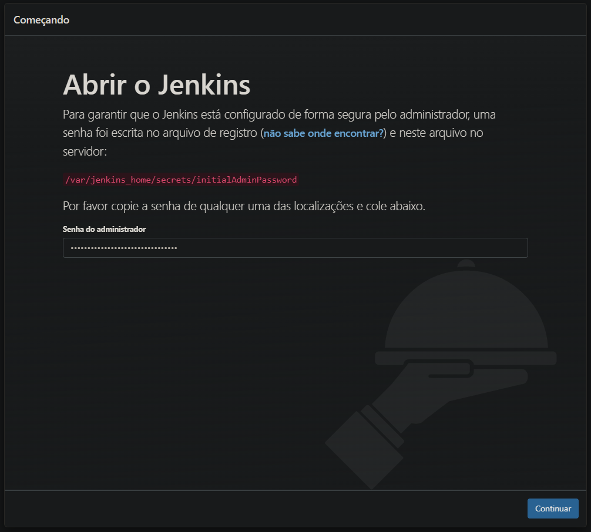
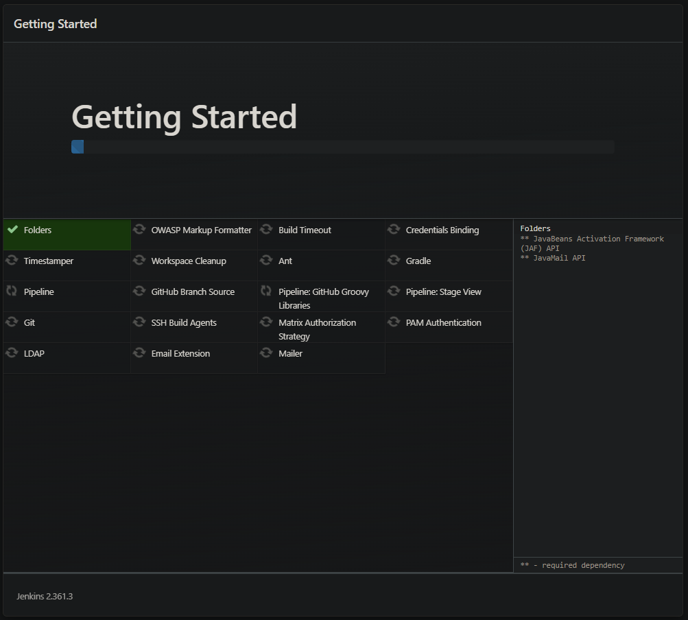
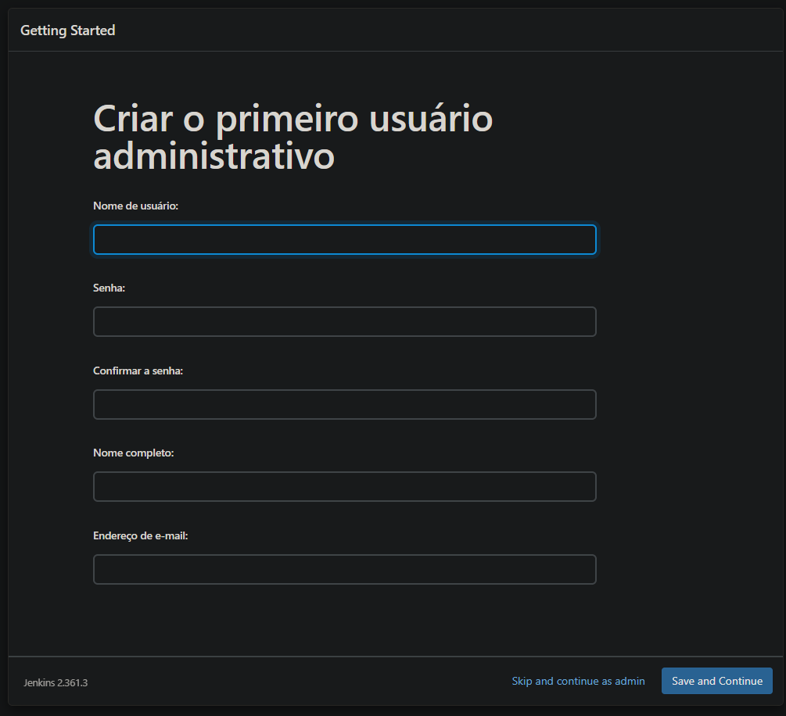
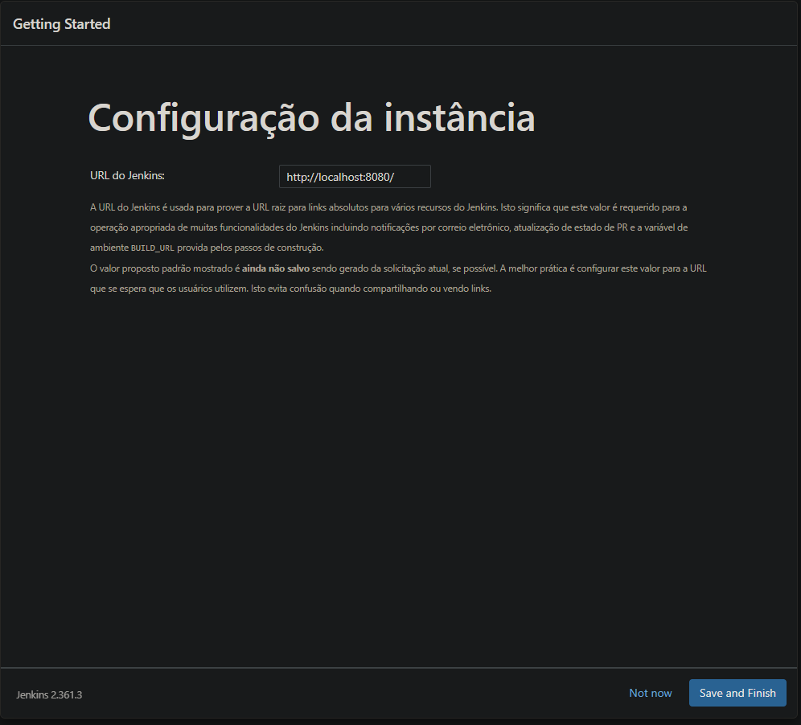
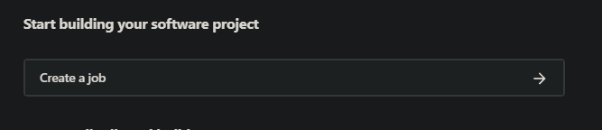
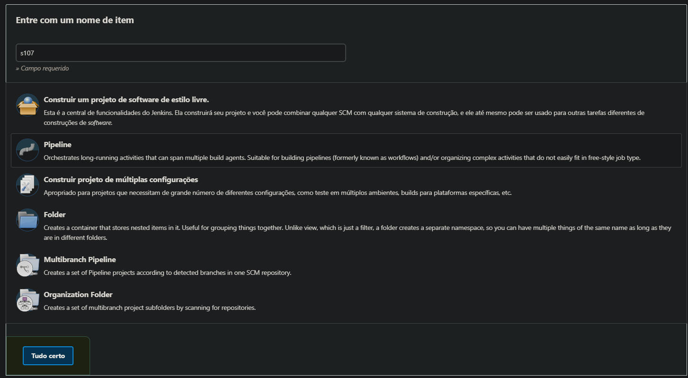
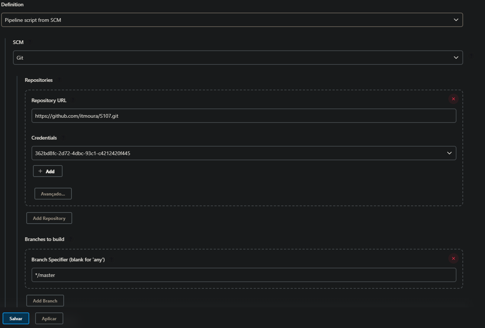
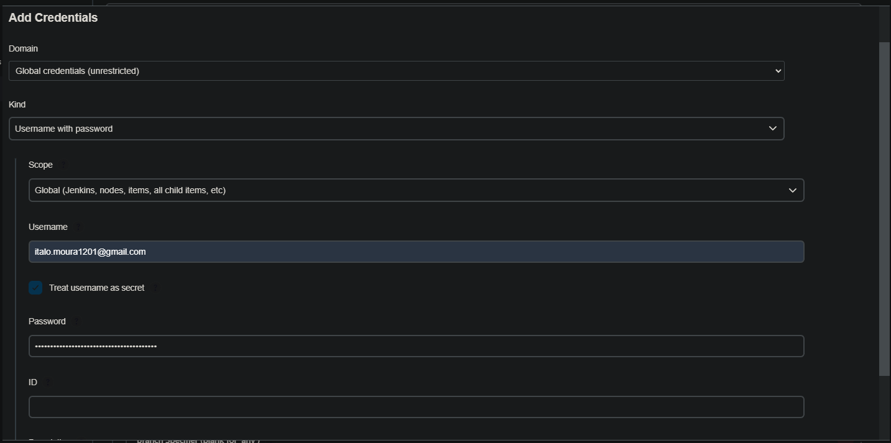
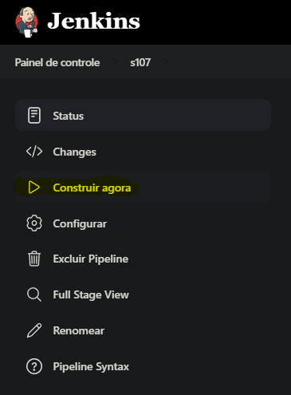
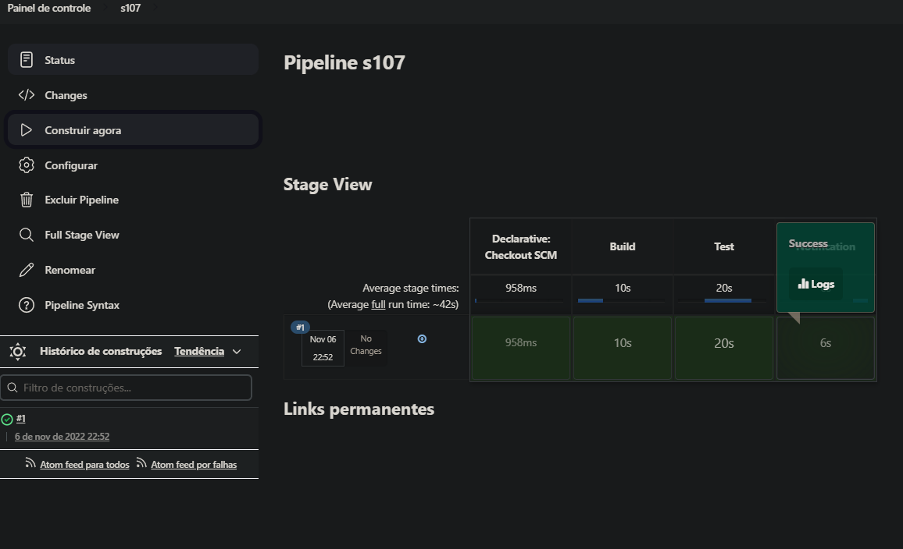

# S107 - Gerência de Configuração e Evolução de Software
- Repositório para a disciplina de Gerência de Configuração e Evolução de Software
- Instituto Nacional de Telecomunicações - Inatel.

## Para rodar deve-se ter instalado:

1. Git Bash (Git for Windows - mais leve)
   https://gitforwindows.org/
2. Docker:
   https://docs.docker.com/get-docker/
3. Opcional para mudar códigos, recomendo IntelliJ IDEA:
   https://www.jetbrains.com/pt-br/idea/download/#section=windows

## Executando o projeto:
1. Faça o clone do projeto:
```
git clone https://github.com/itmoura/S107.git
cd S107
```
2. Já dentro da pasta do projeto, execute o comando, para criar a imagem do docker:
   * **OBS: caso queira mudar o email é necessário fazer isso no arquivo Dockerfile antes de executar o comando abaixo.**
```
docker build --tag="jenkins-s107" 
```
3. Execute o comando para criar o container:
```
docker run -p 8080:8080 -p 50000:50000 --restart=on-failure jenkins-s107 
```
Será gerado uma senha para acesso ao Jenkins, copie e cole no navegador:
4. Acesse o Jenkins no navegador:
```
http://localhost:8080
```

## Configurando o Jenkins:

No próximo passo, clique em "Install suggested plugins" e aguarde a instalação.

Nesse passo pode clicar em "Skip and Finish as admin" ou criar um usuário.

Clique em "Save and Finish" e pronto, o Jenkins está configurado.

Cique em "Start using Jenkins" e pronto, o Jenkins está configurado.

## Criando um novo job:
1. Clique em "Create a Job"

2. Selecione "Pipeline" e adicione um nome para a pipe e clique em "Tudo certo".
   
3. Já nessa próxima tela, clique em "Pipeline script from SCM" e selecione "Git" e adicione a URL do repositório e a sua credencial.
   ```
   https://github.com/itmoura/S107.git
   ```
   
   
4. Depois de adicionar a URL do repositório, clique em "Save" e pronto, o job já está configurado.
   
### Para executar o job, basta clicar em "Construir agora" e aguardar o resultado.
   
   